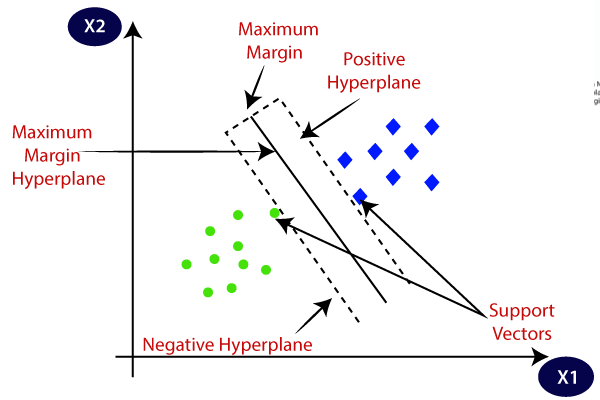
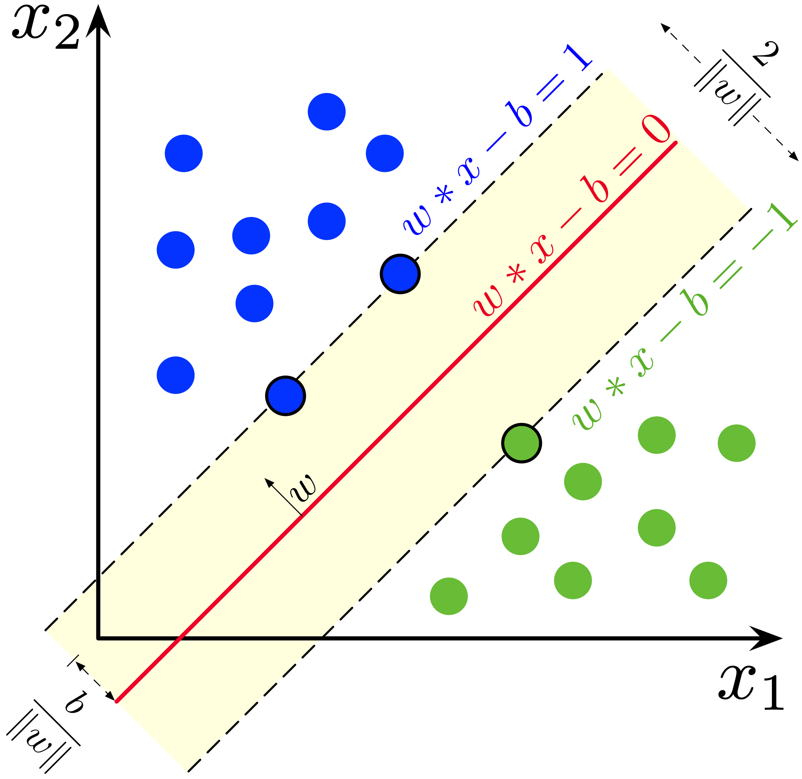
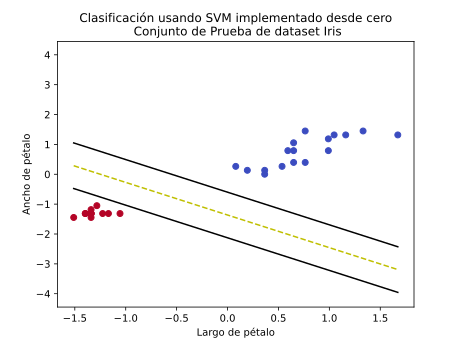

# SVM Lineal: Implementación desde cero
- En este proyecto se implementa desde cero el algoritmo SVM Lineal para realizar clasificaciones binarias y se comparan los resultados con la implementación de Scikit Learn.
- Como datos a estudiar se usa primero un *dataset* de prueba con dos cúmulos de puntos y luego se usa la base de datos Iris (plantas del genero *Iris*) para realizar la clasificación entre clases.
- El proyecto esta compuesto por dos *jupyter notebooks*:
  - **Algoritmo PCA.ipynb**: Donde se crea clase con implementación manual de Supo¿port Vector Machines Lineal.
  - **Implementacion Iris Dataset.ipynb**: Se implementa el algoritmo manual sobre los dos *datasets* mencionados y se comparan resultados con la implementación de Scikit Learn.
 
# Support Vector Machines

- SVM es un algoritmo supervisado de *machine learning* usado generalmente para problemas de clasificación.
- Este algoritmo funciona encontrando el hiperplano que mejor separa los datos en dos clases, separando el espacio de los datos en dos.
- En su versión original el hiperplano define una separación lineal de los datos, pero se puede usar el truco del Kernel para encontrar separaciones no lineales de los datos.
- Originalmente se utiliza para problemas de clasificación binario, pero se puede usar para problemas multiclase, separándolo en una serie de problemas binarios (con métodos *One vs One* o *One vs All* por ejemplo).

</img>

  
> En este proyecto se implementa el algoritmo lineal, usando el método del gradiente descendiente para calcular el hiperplano óptimo y se usa para clasificación binaria entre dos clases.

# Detalles del Proyecto

A grandes rasgos el proyecto se divide en:

- Creación de clase SVM
  - Definición de constructor
  - Definición de método *fit*
  - Definición de método *transform*
- Implementación en *dataset* de cúmulos
  - Creación de *dataset* de prueba
  - Aplicación de algoritmo manual
  - Aplicación de algoritmo de Scikit-Learn
  - Comparación gráfica de resultados.
- Implementación en *dataset Iris*
  - Importacion de datos
  - Aplicación de algoritmo manual
  - Aplicación de algoritmo de Scikit-Learn
  - Comparación gráfica de resultados.
 
## Creación de clase SVM
Código en el *notebook* **Algoritmo SVM.ipynb** con líneas de código explicadas en detalle.

### Definición de Constructor

Se definen las variables relevantes para el algoritmo:
- *learning rate*: Parámetro que define el tamaño de las correcciones de los pesos en entrenamiento.
- *lambda param*: Parámetro que define la importancia relativa entre minimizar los pesos y reducir el número de instancias mal clasificadas y penalizadas.
- *n_iters*: Número de iteraciones para el entrenamiento.
- *w*: Pesos del modelo, que definen el hiperplano para realizar la clasificación.
- *b*: Constante del modelo que define donde el hiperplano cruza el origen.

### Definición de método Fit

Función para ajustar los pesos del modelo, que definen el hiperplano para separar los datos y realizar la clasificación.
Se usa el método del gradiente descendiente para el ajuste de pesos.

</img>

- Se buscan los pesos *w* tal que se cumpla:

$$f(x_i) =
    \begin{cases}
    w\cdot x_i + b \ge 0 & si \space y_i = +1 & \\
    w\cdot x_i + b < 0 & si \space y_i = -1
    \end{cases}$$
    

- Lo que se puede resumir en la ecuación:

$$  y_i \cdot h(x_i) = y_i(w\cdot x_i+b) \ge 1$$

- Donde

$$\space h(x_i) = w\cdot x_i + b$$

- Se quiere minimizar los pesos para reducir la distancia entre los *vectores de soporte*, lo que se describe como:

$$ l(w)= \lambda\|w\|^2 $$

- A la vez, se debe penalizar a las predicciones equivocadas:

$$l_i =
    \begin{cases}
    0 & si \space y_i \cdot h(x_i) \ge 1 & \\
    1 - y_i \cdot f(x_i) & si \space no
    \end{cases}$$

- Juntando ambas condiciones, se busca minimizar la función de costo:

$$J_i =
    \begin{cases}
    \lambda \|w\|^2 & si \space y_i \cdot h(x_i) \ge 1 & \\
    \lambda \|w\|^2 + 1-y_i(w\cdot x_i - b) & si \space no
    \end{cases}$$
    
- Calculando la derivada parcial con respecto a los pesos (para usar el algoritmo de gradiente descendiente) se tiene:

$$\frac{\partial J_i}{\partial w_k} =
    \begin{cases}
    2 \lambda w_k & si \space y_i \cdot h(x_i) \ge 1 & \\
    2 \lambda w_k -y_i\cdot x_{ik} & si \space no
    \end{cases}$$

### Definición de método Predict

Función para predecir clase del dato de entrada.

- Para obtener la predicción del modelo sobre una instancia $x_i$ basta calcular:

$$h(x_i) = w\cdot x_i + b$$

- Y la predicción del modelo es:

$$y_i =
    \begin{cases}
    1 & si \space h(x_i) \ge 0 & \\
    0 & si \space h(x_i) < 0
    \end{cases}$$
    
## Implementación en *dataset* de cúmulos

### Creación de *dataset* de prueba

- Se crean datos de prueba compuesto por dos cúmulos de puntos.
    - Se crean 500 puntos en total.
    - Cada punto está compuesto por dos componentes.
    - Se tiene dos clases, una por cada cúmulo.
- Se normalizan los datos.
- Se separan en conjunto de entrenamiento y de prueba.

</img>

### Aplicación de algoritmo manual
- Importación de Jupyter Notebook con clase SVM usando `%run "Algoritmo SVM.ipynb"`
- Se crea instancia de la clase SVM implementada.
- Se ajustan los pesos del hiperplano con el conjunto de entrenamiento.
- Se realizan predicciones sobre conjunto de prueba.
- Se obtiene un *accuracy* de 100%, puesto que los datos son linealmente divisibles.

### Aplicación de algoritmo de Scikit-Learn

- Se crea instancia de la clase LinearSVC `LinearSVC(C=1, loss="hinge")`
- Se ajustan los pesos del hiperplano con el conjunto de entrenamiento.
- Se realizan predicciones sobre conjunto de prueba.
- Se obtiene un *accuracy* de 100%.

### Comparación gráfica de resultados
- Se grafica la intersección del hiperplano para la clasificación.
- Se grafican los *vectores de soporte*.
- Se grafican los *datapoints*, coloreandolos según su etiqueta real.
- En la primera imágen se muestran el resultado con la implementación manual y en la segunda imágen el resultado con el algoritmo de Scikit-Learn.
- Se puede ver que ambas clasificaciones son casi idénticas y ambos algoritmos encontraron un hiperplano óptimo similar.

</img>

## Implementación en *dataset Iris*

Para probar el algoritmo en datos reales, se importa el *dataset Iris* y se agrupan dos de las tres clases para hacer una clasificación bonaria usando el algoritmo SVM Lineal.

### Importación dataset Iris

- Se importa el *dataset Iris* desde Scikit-Learn.
- Se extraen dos *features* para facilitar la visualización: el ancho y el largo de pétalo.
- Se agrupan las especies *Iris virginica* y *Iris versicolor* en una misma etiqueta para hacer clasificación binaria, diferenciándolas de *Iris setosa*.
- Se normalizan los datos.
- Se separa el *dataset* en conjunto de entrenamiento y de prueba.

</img>

### Aplicación de algoritmo manual
- Importación de Jupyter Notebook con clase SVM y see crea instancia de la clase SVM implementada.
- Se ajustan los pesos del hiperplano con el conjunto de entrenamiento.
- Se realizan predicciones sobre conjunto de prueba.
- Se obtiene un *accuracy* de 100%, ya que los datos son linealmente divisibles.

### Aplicación de algoritmo de Scikit-Learn
- Se crea instancia de la clase LinearSVC.
- Se ajustan los pesos del hiperplano con el conjunto de entrenamiento.
- Se realizan predicciones sobre conjunto de prueba.
- Se obtiene un *accuracy* de 100%.

### Comparación gráfica de resultados
- Se grafica la intersección del hiperplano para la clasificación, los *vectores de soporte* y los *datapoints*, coloreandolos según su etiqueta real.
- En la primera imágen se muestran el resultado con la implementación manual y en la segunda imágen el resultado con el algoritmo de Scikit-Learn.
- Se puede ver que ambas clasificaciones son casi idénticas y ambos algoritmos encontraron un hiperplano óptimo similar.

</img>

